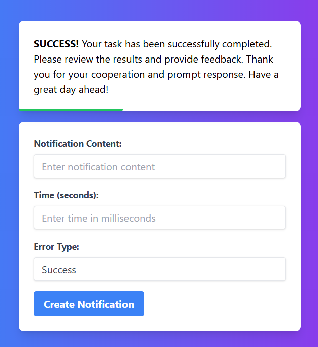

# Custom Notification App

A simple and elegant custom notification app built with Vanilla JavaScript. This project is designed to be completed in approximately 2 hours.

## Features

- **Customizable Notifications**: Create notifications with custom messages, icons, and colors.
- **Auto-Dismiss**: Notifications automatically disappear after a set duration.
- **Progress Bar**: To show when Notifications will disappear
- **Notification Queue**: Handle multiple notifications in a queue.

## Example

## This is how your project will look like
