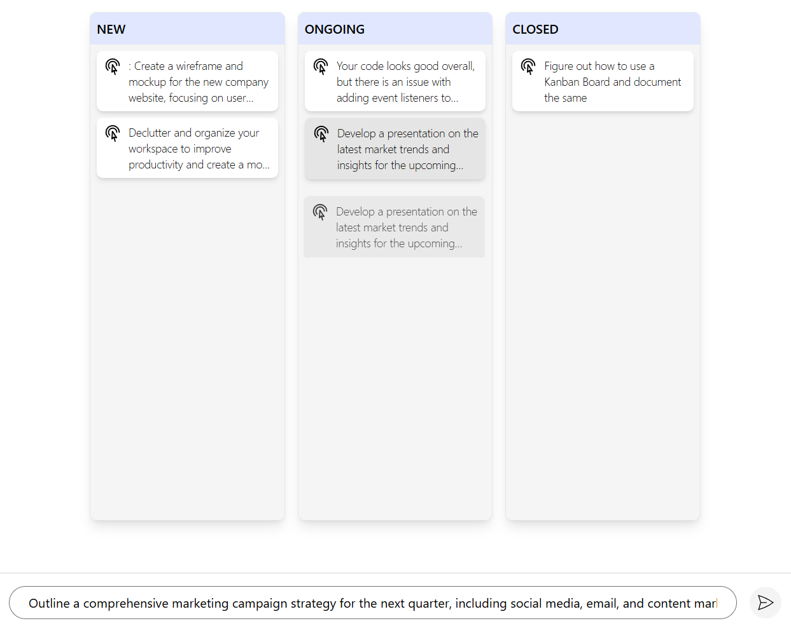

## Interactive Kanban Board with Drag & Drop

- **Add Tasks**: Users can add new tasks using a form.
- **Drag and Drop**: Tasks can be dragged and dropped between different lanes.
- **Dynamic Task Creation**: Newly created tasks are automatically assigned drag event listeners.

### This is how your project will look like

