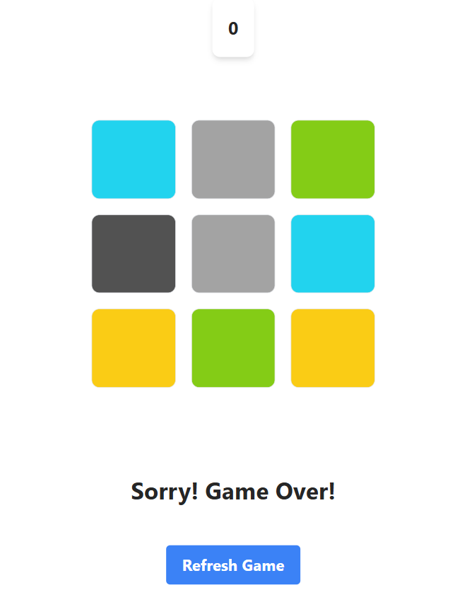

# Memory Game

## Problem Statement

- Develop a memory game where players flip cards to find matching pairs.
- Include a countdown timer to track the game duration.
- Implement a start button to begin the game.
- End the game when a black card is flipped or the timer runs out.
- Display the current game status (e.g., "In Progress", "Lose").
- Block further interactions once the game ends.
- Use JavaScript for game logic and Tailwind CSS for styling.
- Ensure the game is responsive and visually appealing.
- Provide a smooth user experience.

## This is how your project will look like
