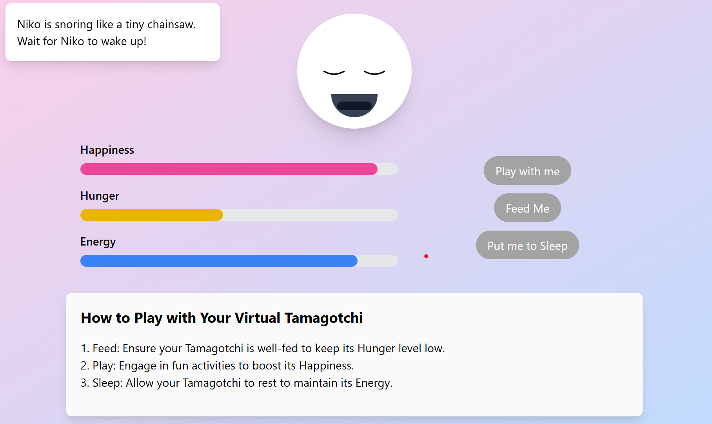

# Virtual Tamagotchi - 2 Hour Project

## Overview
Build a basic virtual Tamagotchi using JavaScript, HTML, and TailwindCSS within two hours. Focus on creating an interactive pet game with essential features.

## Features
1. **Pet Stats**: Display Hunger, Happiness, and Energy using TailwindCSS-styled progress bars.
2. **Actions**:
   - **Feed**: Reduces Hunger, slightly lowers Energy.
   - **Play**: Increases Happiness, decreases Energy.
   - **Sleep**: Restores Energy, increases Hunger.
3. **Time-based Decay**: Use `setInterval` to reduce stats over time.
4. **Game Over**: Reset game when any stat reaches zero.
5. **Persistent State**: Save stats in `localStorage` for page refresh.

## Tech Stack
- **HTML**: Structure.
- **JavaScript**: Game logic and interactions.
- **TailwindCSS**: Responsive styling.

## Tools
- **CDNs**: TailwindCSS, optional SweetAlert2 for notifications.

## This is how your project will look like
