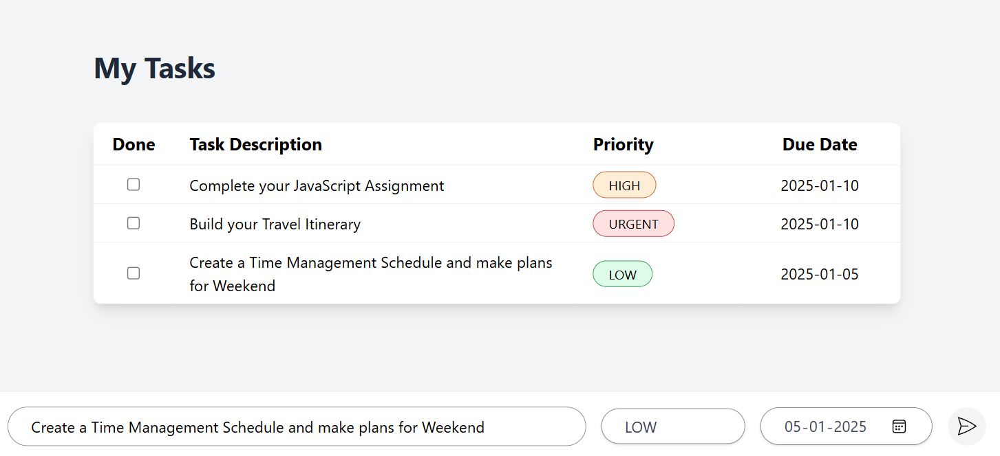

## To-Do App Specification

- **Task Management:**  - Create Tasks
- **Due Date:** - Assign due dates to tasks.
- **Priority:** - Set priority levels (e.g., high, medium, low) for tasks.
- **Completion Status:** - Add a checkbox to mark tasks as done.
- **User Interface - Simple and intuitive design.

## This is how your project will look like

JavaScript concepts:

DOM manipulation, event handling, array methods, object-oriented programming, asynchronous programming, local storage, template literals, ES6 modules, error handling, form validation

