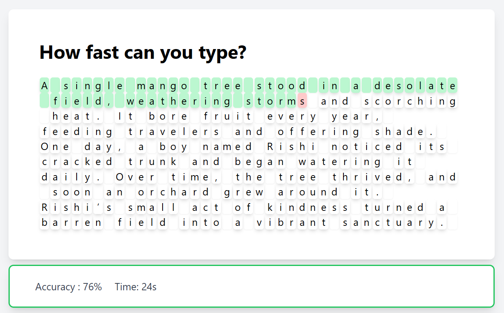

# Typing Speed Test

## Project Overview
This project is a simple typing speed test application that measures the user's typing speed in words per minute (WPM). The user is presented with a random text to type, and the application calculates the typing speed and accuracy.

## Features
- Random text generation for typing test (show 5 words at a time)
- Timer to measure typing duration
- Calculation of typing speed (WPM)
- Calculation of typing accuracy
- Display of results

### Demo Image:
