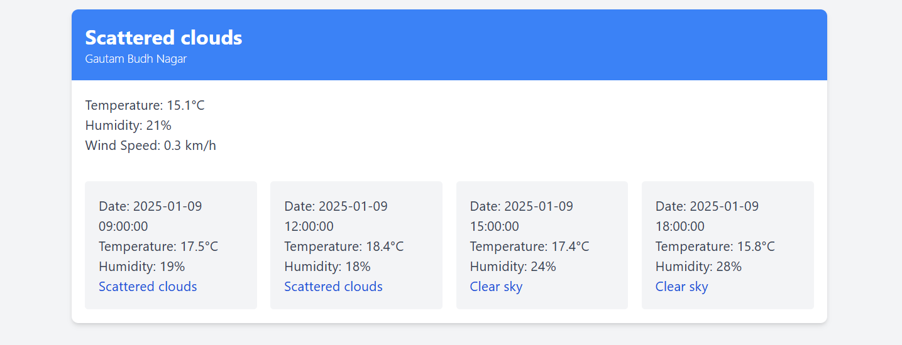

## Weather Forecast Display using the OpenWeather Public API
- **Description**: Responsive weather forecast display using Tailwind CSS.
- **Features**:
  - Current weather conditions (storm, temperature, humidity, wind speed).
  - Responsive grid layout for weather forecast.
  - Weather prediction for the next 5 Days.
  - Use OpenWeather API for fetching weather

- **Technologies**:
  - HTML
  - Tailwind CSS

## This is how your project will look like

